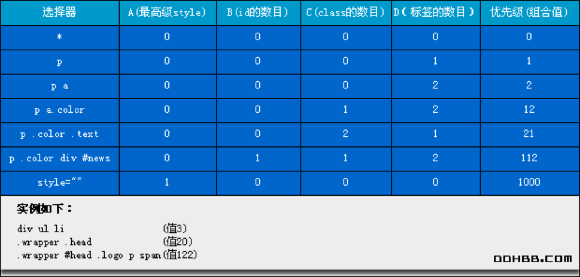
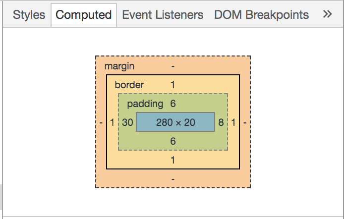

# CSS Basic

## CSS Selector

- 元素选择器 `h1`
- 类选择器 `.classname`
- id选择器 `#id`
- 全局选择器 `*`
- 继承选择器 `div p` `div > p`
- 选择器分组 `h1, h2`
- 伪类选择器 `:hover`
- CSS属性选择器 `input[type=“button”]`

## CSS Selector的执行顺序

  `#someId .className div`   
  从右向左

## 选择器的优先级

  

- `!important`最高，不到万不得已不用
- 尽量不用style和id

## Box Model 盒模型

  

```css
margin: 1px 2px 3px 4px; //上，右，下，左
margin: 1px 2px 3px; //上，右左，下
margin: 1px 2px; //上下，右左
margin: 1px; //上右下左
```

- padding vs. margin
  - 主内 vs. 主外
  - border内外
  - 有无背景
  - 盒子之间垂直空白需要叠加还是抵消
- box-sizing & width
